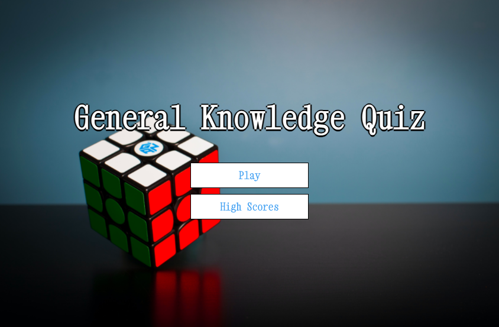
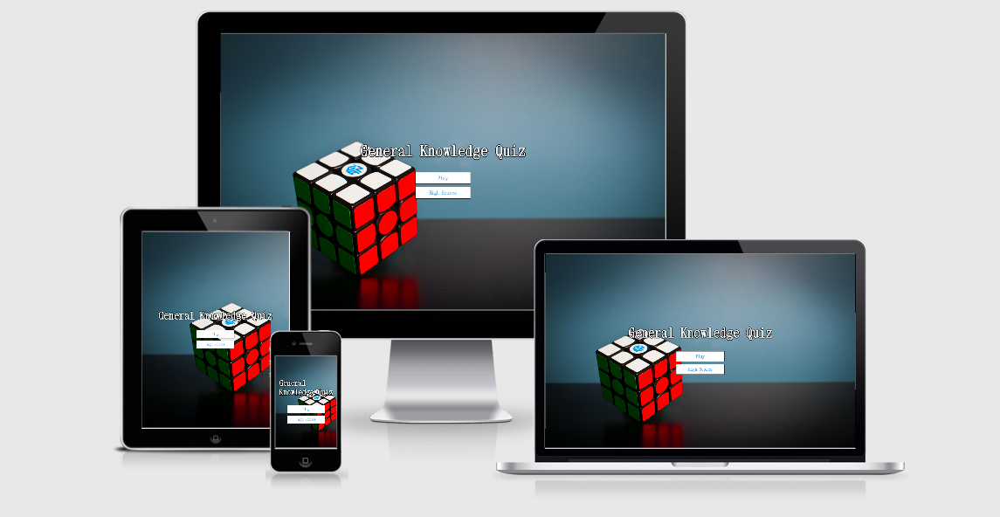
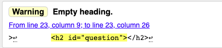
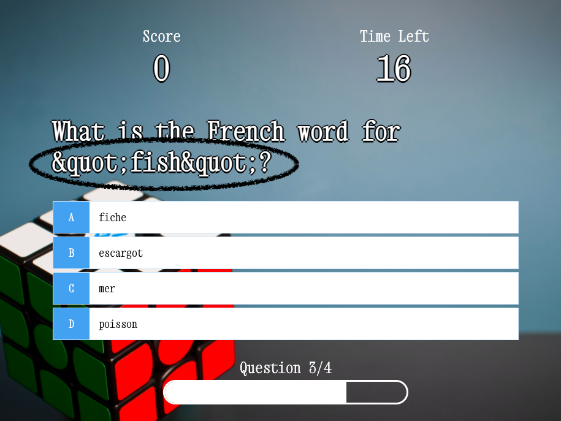

# Trivia Game

The live website can be found [here](https://sophieboyle1.github.io/Trivia-game/.)

## Purpose

This Website was created for the sole purpose of completing the second Milestone Project for the Code Institute's Full Stack Developer course. It was built using the knowledge gained from the HTML, CSS, User Centric Design, JavaScript Fundamentals and Interactive Frontend Development modules. A full list of technologies used can be found in the [technologies](#Technologies-Used) section of this document.

## Table of Contents

* [User Experience Design (UX)](#User-Experience-Design)
   * [The Strategy Plane](#The-Strategy-Plane)
     * [User stories](#User-Stories)
   * [The Scope Plane](#The-Scope-Plane)
   * [The Skeleton Plane](#The-Skeleton-Plane)
     * [Wireframes](#Wireframes)
   * [The Surface Plane](#The-Surface-Plane)
* [Features](#Features)
   * [Existing Features](#Existing-Features)
   * [Future Features](#Features-Left-to-Implement)
* [Technologies](#Technologies)
* [Testing](#Testing)
  * [Code Validators](#Code-Validators)
  * [Compatibility](#Compatibility)
  * [Testing User Stories](#Testing-User-Stories)
  * [Additional Functionality](Additional-Functionality)
  * [Issues](#Issues)
* [Deployment](#Deployment)
  * [GitHub Pages](#Using-Github-Pages)
  * [Locally](Run-Locally)
* [Credits](#Credits)
  * [Code](#Code)
  * [Acknowledgements](#Acknowledgements)

****
## User Experience Design
### The Strategy Plane
This website was created to showcase my knowledge of HTML, CSS & JavaScript and to provide users with entertainment and to challenege their general knowledge skills. The game should be easy to understand, with some fun apects with time and point system.

Site Goals:
* To showcase the skills I have learnt in HTML, CSS, JavaScript.
* To provide users with a fun quiz game, that has a score and time system also showing the leading scores when completed.
* To create an enjoyable, interactive game that makes the user want to stay and play again.
* To create a game that makes the user want to return to the website.

### User stories
* As a user, I want to easily understand the main purpose of the site.
* As a user, I want to view the website and content clearly on any device.
* As a user, I want to see clearly where to begin the game when I am ready.
* As a user, I want to see my previous highest scores also.
* As a user, I want to know how much time I have left to answer the remaining questions.
* As a user, I want to know which questions i have answered correctly as I play.
* As a user, I want to know when the game is over.
* As a user, I want to see my score as I asnwer each question.
* As a user, I want a way to start a new game when the current game has ended.

## The Scope Plane

Features planned:

* A simple and clean homepage to illustrate exactly what game you are playing.
* Play and Highscores buttons to navigate clearly through the game.
* Score Count.
* Timer to make the game a little more fun and competitive.
* Red and green colours to show answer is correct or incorrect.
* A question progress bar to show which question you are currently on.
* Leader score board to log in all the users highest scores.
* Use a API to get a wide range of questions.
* I decided not to let the user see the correct answer after answering incorrect as I wanted to add more initiative for the user to return to the site.

****
## The Skeleton Plane
### Wireframes

* For wireframing I used the tool [Balsamiq](https://balsamiq.com/)
* View my wireframes [here](assets/images/Trivia-wireframe.png)
    * Home page
    * Quiz page
    * End page
    * Score board

****
## The Surface Plane
### Design

#### Icons and Images
* The icon used on the website is provided by [FontAwesome](https://fontawesome.com/) on the score board .
* The background image used on all pages is provided by [Unsplash](https://unsplash.com/)

#### Typography
* I used the same font of Xanh Mono by [Google Fonts](https://fonts.google.com/specimen/Xanh+Mono) throughout the project for a clean and classic design.
* I used a text shadow for all headings to give dimension and readability.
* All buttons throughout the application have a hover effect to indicate to the user of where they would like to go next.

#### Colour Scheme
* The colour scheme is kept classic as I didnt want to over-power the background image.
* Text colours consist of Black, White and light blue [#56a5eb](https://placehold.it/15/56a5eb/000000?text=+).

****
## Features

### Existing Features
* Responsiveness on all screen sizes.
* Landing page buttons to start game or view highest scores.
* Timer set to 30secs to complete quiz.
* Score count, each correct question recieves 100 points.
* Progress bar, shows which question user is currently on.
* Username form input to save scores.
* End page buttons for navigation, Play again, Home, High scores.

### Features Left to Implement
* In the furture I would like to implement different catagories section, where the user can choose from a list of different catagories. eg. Science, Music, Television.
* Game modes:
  * Give the user a choice of three game modes, 'Easy', 'Medium' or 'Hard'. Each level will go up in difficulty along with the choice of a catagory.

****
## Technologies

### Languages
* [HTML](https://en.wikipedia.org/wiki/HTML) Used to structure and present the website.
* [CSS](https://en.wikipedia.org/wiki/CSS) Used to style the website.
* [JavaScript](https://en.wikipedia.org/wiki/JavaScript) Used to provide functionality across the site, including on click button fuctions, applying settings, populating the quiz data using the [Trivia DB API](https://opentdb.com).

### Tools & Libraries
* [Google Fonts](https://fonts.google.com/) Used to import the "Xanh Mono" font used throughout the site.
* [Font-Awesome](https://fontawesome.com/) Used to import the icon used on the leaderboard.
* [balsamiq Wireframes](https://balsamiq.com/wireframes/) Used to create the wireframes during the planning stage of the project.
* [W3schools](https://www.w3schools.com/howto/howto_css_loader.asp) Used to design the loader for periods of waiting seconds.
* [Google Chrome Developer Tools](https://developers.google.com/web/tools/chrome-devtools) Google chromes built in developer tools are used to inspect page elements and help debug issues with the site layout and test different CSS styles.
* [GitHub](https://github.com/) GithHub is the hosting site used to store the source code for the Website and [Git Pages](https://pages.github.com/) is used for the deployment of the live site.
* [Git](https://git-scm.com/)- is used as version control software to commit and push code to the GitHub repository where the source code is stored.
* [Flexbox](https://developer.mozilla.org/en-US/docs/Learn/CSS/CSS_layout/Flexbox) The Flexbox layout is used throughout this website for layouts and styling.
* 

****
## Testing

### Code Validators
* CSS code is validated through [W3 Jigsaw](https://validator.w3.org/) and showed no errors.
* JS code is validated through [JS Hint](https://jshint.com/) with no major issues.
* When HTML code is validated through [W3 validator](https://validator.w3.org/) it will show a warning of "empty heading". This heading will be populated by JavaScript file once it is loaded.

### Compatibility
* Devices - The website has been viewed and tested on a range of devices including Desktop, Laptop, Iphone 6/7/8/X, Ipad and Samsung Galaxy Tab, retaining structure and functionality.

* Browsers - The website has been viewed and tested on a range of browsers including Google Chrome, Internet Explorer and Firefox, retaining structure and functionality.

### Testing User Stories
* As a user, I want to easily understand the main purpose of the site.
   * On the landing page "General knowledge Quiz" is written in bold text.
* As a user, I want to view the website and content clearly on any device.
  * Website has been tested and is responsive on iphone, tablet, labtop and desktop.
  * All elements are contained and the image is not distored.
* As a user, I want to see clearly where to begin the game when I am ready.
  * This page is easily accesible from the homepage using the play button.
* As a user, I want to see my previous highest scores also.
  * Once you have played the game and recieved your score, the user can input a username and save.
  * When the user returns to the home page, there will be the high scores button where the user can check the previous scores.
  * I have set a maxium amount of high scores to 5.
* As a user, I want to know how much time I have left to answer the remaining questions.
  * Once the user starts the quiz, the progress bar underneath the answer choices will move with every answer, showing which question they are currently on. 
* As a user, I want to know which questions i have answered correctly as I play.
  * Once an answer is selected, testing confirms the answer will turn green if correct.
  * Once an answer is selected, testing confirms the answer will turn red if incorrect.
* As a user, I want to know when the game is over.
  *  If all questions are completed, the quiz will be complete and finish on the end page where the user can enter a username.
  * If the timer runs out before the user answers all questions, the user can stil enter a username.
  * There will be 2 buttons options, to play again or return to the home page.
* As a user, I want to see my score as I asnwer each question.
  * Testing confirms that if the correct answer is selected, the score will increase by 100.
* As a user, I want a way to start a new game when the current game has ended.
  * Testing confirms the buttons are functioning so that the user can select the button to play again, or return home.

### Additional Functionality
* Allowing single answer- This has been tested to ensure that once an answer is clicked, all other answer buttons are disabled other than the Next Question Button.

* Form Testing- Tested the Save button with no input field filled in to ensure the form would not submit without a name filled in.

* Link Testing - Ensured all links are working correctly to navigate smoothly between pages.

#### Issues

* Not loading correctly.
   * When the user is completing the quiz, there was a issue with the wrong score being loaded if the user ran out of time before completing the quiz. I fixed the issue by adjusting the local storage to correctly match with the current score "localStorage.setItem('mostRecentScore', score); " .

* There is an Issue with the [Trivia DB API](https://opentdb.com) that I am using. It shows dummy text rather than showing the "apostrophe" symbol.
* I tired to fix the issue by creating a function to remove the special characters from the questions but it was unsuccessful. I also tried encoding the issue with different incoders.
* I consulted with my mentor and he confirmed it is a bug issue connected with the API, and not with my coding.

 
****
## Deployment
### Using Github Pages
1. Navigate to the GitHub [Repository:](https://github.com/sophieboyle1/Trivia-game)
1. Click the 'Settings' Tab.
1. Scroll Down to the Git Hub Pages Heading.
1. Select 'Master Branch' as the source.
1. Click the Save button.
1. Click on the link to go to the live deployed page.

### Run Locally
1. Navigate to the GitHub [Repository:](https://github.com/sophieboyle1/Trivia-game)
1. Click the Code drop down menu.
1. Either Download the ZIP file, unpackage locally and open with IDE (This route ends here) OR Copy Git URL from the HTTPS dialogue box.
1. Open your developement editor of choice and open a terminal window in a directory of your choice.
1. Use the 'git clone' command in terminal followed by the copied git URL.
1. A clone of the project will be created locally on your machine.

****
## Credits

### Code
* The JavaScript hangman game was created by following a tutorial on [Youtube](https://www.youtube.com/watch?v=f4fB9Xg2JEY) This was then heavily modified to fit the game design. I added a timer to being at 30 seconds, with the game ending when the time runs out. I also added a [Trivia DB API](https://opentdb.com) to give a diverse range of questions.
* I used [W3schools](https://www.w3schools.com/howto/howto_css_loader.asp) to help with building the loader function.
* The background image used on all pages is provided by [Unsplash](https://unsplash.com/s/photos/quiz)
* [Code Institute](https://codeinstitute.net) Code learnt during the Full Stack Web Developer course has been implemented in this project.

### Acknowledgements

* My tutor Roman at the Kerry ETB for all the support he gives daily.
* I'd like to thank my mentor Spencer Barriball for his patience and guidance throughout my project.
* All at Code Institute and Tutor support.

